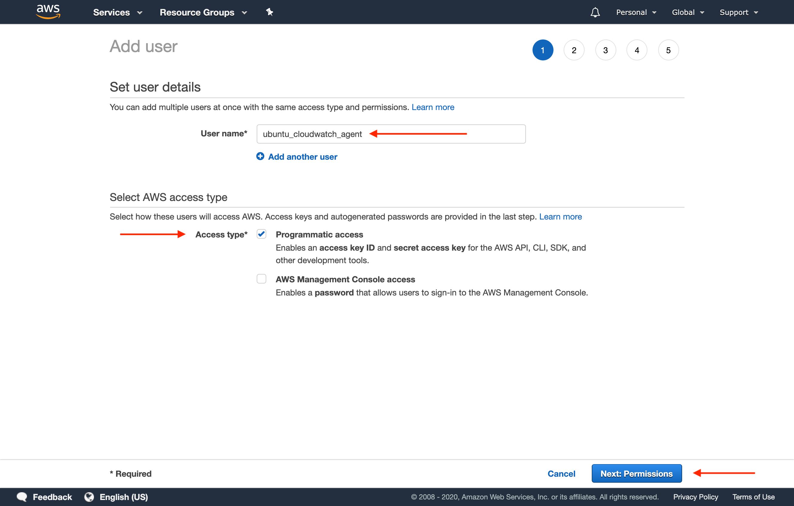

# Wrangling your Laravel Logs with AWS CloudWatch
*By James Nicholson*


## Requirements

1. An Ubuntu server (preferably v18.04 but may work with earlier verisions) with an IP address reachable from the internet.
2. An AWS account. This will require setting up a payment method, but the usage from this guide will not exceeed the free tier, and thus no actual charges should occur.
3. A Laravel application running on the Ubuntu server (only if you want to collect Laravel logs).

## Introduction

The goal of this document is to guide the reader through the process of setting up Amazon Cloudwatch to aggregate
log files from a Laravel application running on Ubuntu 18.04.

No matter what technology stack you're using, log files are always important. You may not always need them, but when
you do it's usually because there's some kind of problem in your application. In the case of dealing with a bug that's
frusterating users, you don't want to be wasting time searching your file system for the right line of the right log
file that will shed light on your issue. This is where logging analytics platforms shine.

Amazon Cloudwatch is a powerful logging and monitoring analytics platform. Here's a description of it's capabilities
from Amazon's website:

>CloudWatch collects monitoring and operational data in the form of logs, metrics, and events, providing you with a unified view of AWS resources, applications, and services that run on AWS and on-premises servers. You can use CloudWatch to detect anomalous behavior in your environments, set alarms, visualize logs and metrics side by side, take automated actions, troubleshoot issues, and discover insights to keep your applications
running smoothly.

Don't be confused by the mention of "services that run on AWS and on-premises servers". CloudWatch is also compatible
with other cloud computing providers, such as DigitalOcean.

#### What log files to collect?

Every application will have different log files that are important. It depends what the technology stack is. In this
guide we're dealing with a Laravel application running a LAMP stack on Ubuntu 18.04. For the sake of brevity, we're
going to focus on a few important log files for this stack:

1. Default Laravel log file (with $ROOT being the root of your Laravel application)
  
`$ROOT/storage/logs/laravel.log`

2. MySQL error log  
  
`/var/log/mysql/error.log`

3. Apache error log  
  
`/var/log/apache2/error.log`

4. Ubuntu system log  
  
`/var/log/syslog`


## Create the AWS IAM User

1. Sign in to the AWS Management Console and open the IAM console at https://console.aws.amazon.com/iam/
2. In the navigation pane, choose Users, and then choose Add user.
<br>
<br>
3. Enter the user name for the new user.
4. For Access type, select Programmatic access, and then click the "Next: Permissions" button.
<br>
5. For Set permissions, choose Attach existing policies directly.
6. In the list of policies, select the check box next to CloudWatchAgentServerPolicy. If necessary, use the search box to find the policy.
7. Click the "Next: Tags" button.
<br>
8. No need to set any tags (you can if you want to). Click the "Next: Review"
9. Confirm that the correct policies are listed, and then click the "Create user" button.
<br>
10. If your user was successfully created, click the "Download .csv" button to download your credentials. You'll need them for the next sections.
<br>**Important:** this is the only opportunity you'll have to download these credentials, so don't skip this step. If for some reason you do lose them however, you can always go back and create new permissions for this user.
<br>

## Install and Configure the CloudWatch Agent on Ubuntu 18.04

1. SSH into your server as the `root` user.
2. Navigate to the /tmp directory.  
`cd /tmp`
3. Download the CloudWatch Agent  
`wget https://s3.amazonaws.com/amazoncloudwatch-agent/ubuntu/amd64/latest/amazon-cloudwatch-agent.deb`
4. Install the CloudWatch Agent  
`dpkg -i -E ./amazon-cloudwatch-agent.deb`
5. Use the agent configuration wizard to create your config file. For more information on answering all the questions
correctly see [this Amazon documentation](https://docs.aws.amazon.com/AmazonCloudWatch/latest/monitoring/create-cloudwatch-agent-configuration-file-wizard.html). When it asks if you want to add log files, use the URLs above.  
`/opt/aws/amazon-cloudwatch-agent/bin/amazon-cloudwatch-agent-config-wizard`

Here's all my answers to the configuration wizard in case you want to compare:

```shell
root@e15:/opt/aws/amazon-cloudwatch-agent/bin# /opt/aws/amazon-cloudwatch-agent/bin/amazon-cloudwatch-agent-config-wizard
=============================================================
= Welcome to the AWS CloudWatch Agent Configuration Manager =
=============================================================
On which OS are you planning to use the agent?
1. linux
2. windows
default choice: [1]:
1
Trying to fetch the default region based on ec2 metadata...
Are you using EC2 or On-Premises hosts?
1. EC2
2. On-Premises
2
Please make sure the credentials and region set correctly on your hosts.
Refer to http://docs.aws.amazon.com/cli/latest/userguide/cli-chap-getting-started.html
Which user are you planning to run the agent?
1. root
2. cwagent
3. others
default choice: [1]:
1
Do you want to turn on StatsD daemon?
1. yes
2. no
default choice: [1]:
2
Do you want to monitor metrics from CollectD?
1. yes
2. no
default choice: [1]:
2
Do you want to monitor any host metrics? e.g. CPU, memory, etc.
1. yes
2. no
default choice: [1]:
2
Do you have any existing CloudWatch Log Agent (http://docs.aws.amazon.com/AmazonCloudWatch/latest/logs/AgentReference.html) configuration file to import for migration?
1. yes
2. no
default choice: [2]:
2
Do you want to monitor any log files?
1. yes
2. no
default choice: [1]:
1
Log file path:
/var/www/html/e15/nutmeg/storage/logs/laravel.log
Log group name:
default choice: [laravel.log]
Laravel
Log stream name:
default choice: [{hostname}]

Do you want to specify any additional log files to monitor?
1. yes
2. no
default choice: [1]:
1
Log file path:
/var/log/mysql/error.log
Log group name:
default choice: [error.log]
Mysql
Log stream name:
default choice: [{hostname}]

Do you want to specify any additional log files to monitor?
1. yes
2. no
default choice: [1]:
1
Log file path:
/var/log/apache2/error.log
Log group name:
default choice: [error.log]
Apache
Log stream name:
default choice: [{hostname}]

Do you want to specify any additional log files to monitor?
1. yes
2. no
default choice: [1]:
1
Log file path:
/var/log/syslog
Log group name:
default choice: [syslog]
Ubuntu
Log stream name:
default choice: [{hostname}]

Do you want to specify any additional log files to monitor?
1. yes
2. no
default choice: [1]:
2
Saved config file to /opt/aws/amazon-cloudwatch-agent/bin/config.json successfully.
Current config as follows:
{
	"agent": {
		"run_as_user": "root"
	},
	"logs": {
		"logs_collected": {
			"files": {
				"collect_list": [
					{
						"file_path": "/var/www/html/e15/nutmeg/storage/logs/laravel.log",
						"log_group_name": "Laravel",
						"log_stream_name": "{hostname}"
					},
					{
						"file_path": "/var/log/mysql/error.log",
						"log_group_name": "Mysql",
						"log_stream_name": "{hostname}"
					},
					{
						"file_path": "/var/log/apache2/error.log",
						"log_group_name": "Apache",
						"log_stream_name": "{hostname}"
					},
					{
						"file_path": "/var/log/syslog",
						"log_group_name": "Ubuntu",
						"log_stream_name": "{hostname}"
					}
				]
			}
		}
	}
}
Please check the above content of the config.
The config file is also located at /opt/aws/amazon-cloudwatch-agent/bin/config.json.
Edit it manually if needed.
Do you want to store the config in the SSM parameter store?
1. yes
2. no
default choice: [1]:
2
Program exits now.
```

6. Create the AmazonCloudWatchAgent profile for the CloudWatch agent.

```aws configure --profile AmazonCloudWatchAgent```

Here's all my answers from the profile wizard in case you want to compare answers (I had already created my profile
before capturing this output, which is why you're seeing my obfuscated ID and Key).

```shell
root@e15:/opt/aws/amazon-cloudwatch-agent/bin# aws configure --profile AmazonCloudWatchAgent
AWS Access Key ID [****************2LIA]:
AWS Secret Access Key [****************LlSe]:
Default region name ["us-east-1"]: us-east-2
Default output format [json]:
root@e15:/opt/aws/amazon-cloudwatch-agent/bin#
```
<br>**Important:** You need to enter the correct default region that your AWS account uses. See the below screenshot
for where to find that info.

<br>


## Start the CloudWatch service

`/opt/aws/amazon-cloudwatch-agent/bin/amazon-cloudwatch-agent-ctl -a fetch-config -m onPremise -c file:/opt/aws/amazon-cloudwatch-agent/bin/config.json -s`

You should now be able to visit your CloudWatch console and view the logs you setup above.

<br>

For more information on configuration and usage, refer to the official CloudWatch documentation:
https://docs.aws.amazon.com/AmazonCloudWatch/latest/monitoring/Install-CloudWatch-Agent.html


## Sources

1. AWS CloudWatch Online Docs: https://docs.aws.amazon.com/AmazonCloudWatch/latest/monitoring/Install-CloudWatch-Agent.html
2. Pete Freitag blog post: https://www.petefreitag.com/item/868.cfm
